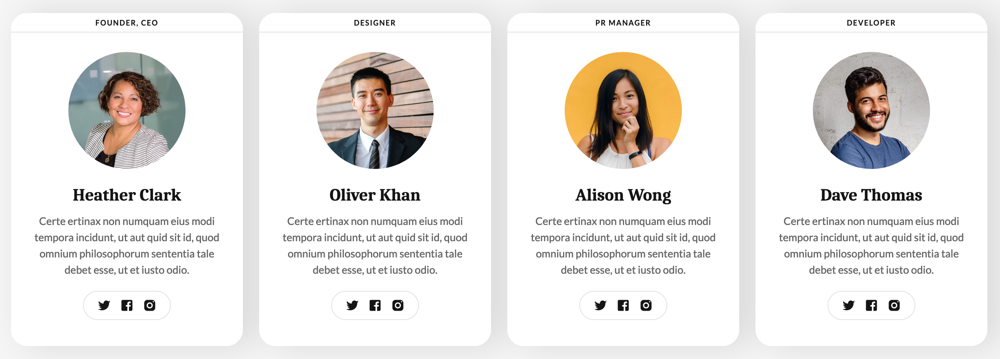

# End of Field Challenge

## Description
An exercise for the Becode frontend developer course in recreating certain interfaces from a picture
using html and css.
No usage of frameworks was allowed during this exercise.

## Details
 - Mode: solo
 - Type of Challenge: consolidation
 - Duration: 1 day
 - Deployment strategy: GitHub Pages

### Tools used:
- VS Code
- Git

### Languages used:
 - HTML
 - CSS
 - SCSS
  

## Interface 16
A simple interface displaying certain key selling points of a service.

[Interface 16](https://renv123.github.io/end-of-field-challenge/interface-16/index.html)

## Interface 10 (Complex)
An overview of cards displaying certain employees.

[Interface 10 (Complex)](https://renv123.github.io/end-of-field-challenge/interface-complex-10/index.html)